# Cosmic Clocks

**Twelve dead stars that still keep perfect time.** An interactive listening room for pulsars:
tune a radio dial across twelve real neutron stars, hear each one tick at its true rotation rate,
and fly between them across a model of the Milky Way.

### ▶ [Try it live: mateuszkrw-coder.github.io/cosmic-clocks](https://mateuszkrw-coder.github.io/cosmic-clocks/)

[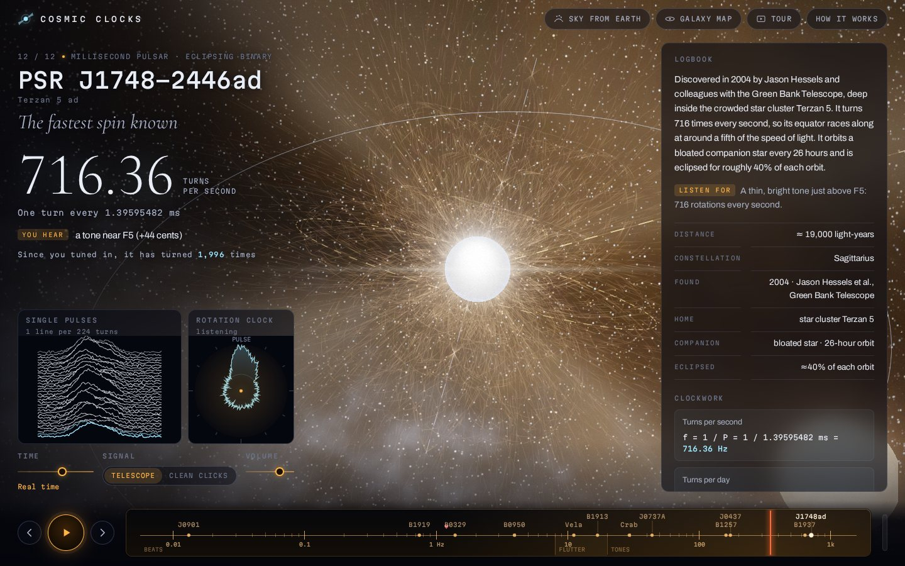](https://mateuszkrw-coder.github.io/cosmic-clocks/)

Runs in any modern browser on desktop or phone. Press **Tune in with sound** and turn the volume up
(headphones help with the slow ones). Nothing to install.

To run it offline, download [`dist/cosmic-clocks.html`](dist/cosmic-clocks.html) (the whole site in one
file) and double-click it, or clone the repository and open `index.html`. No build step, no dependencies,
no server needed.

## Screenshots

<table>
<tr>
<td width="50%">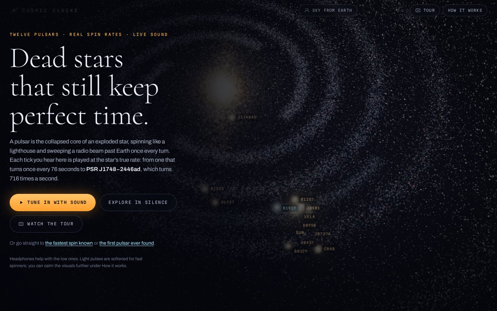<br><sub><b>Start screen.</b> The twelve pulsars marked at their real positions in the galaxy.</sub></td>
<td width="50%">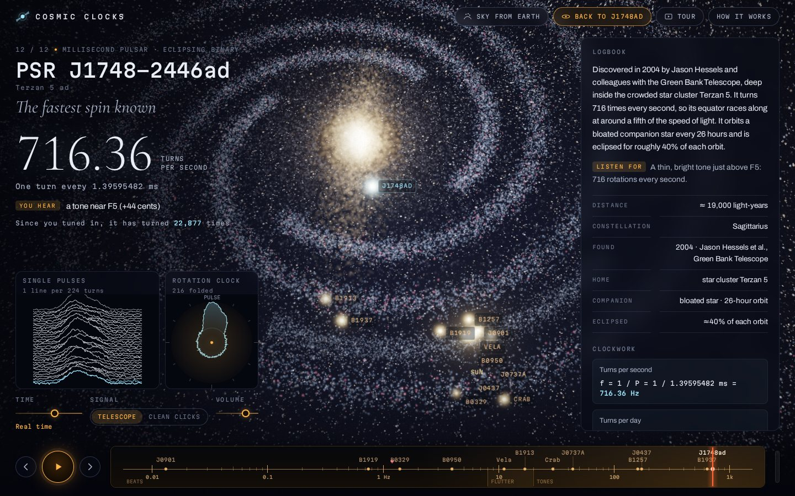<br><sub><b>Galaxy map.</b> Where each pulsar sits relative to the Sun. Switching stars flies you there.</sub></td>
</tr>
<tr>
<td>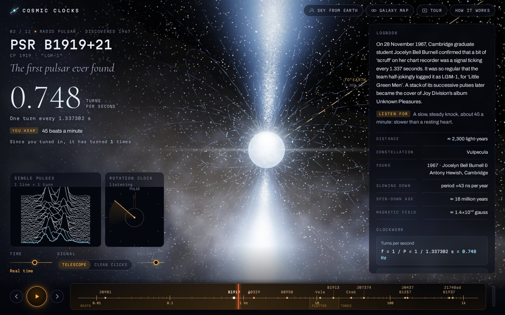<br><sub><b>PSR B1919+21</b>, the first pulsar ever found (1967). The pulse stack is drawn like the famous <i>Unknown Pleasures</i> plot.</sub></td>
<td>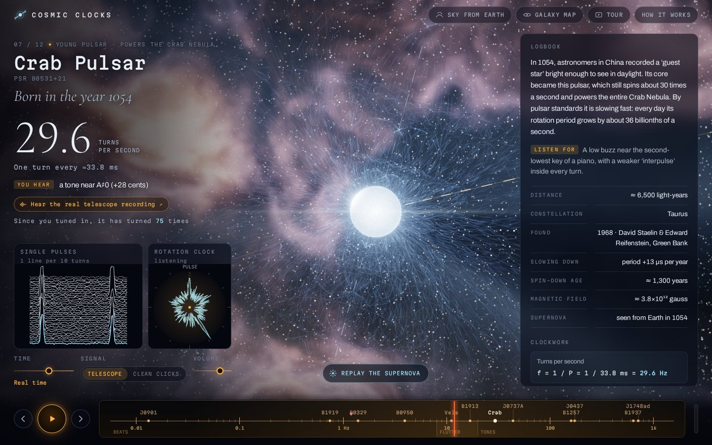<br><sub><b>The Crab pulsar</b> inside its nebula, turning 29.6 times a second: you hear a low buzz.</sub></td>
</tr>
<tr>
<td>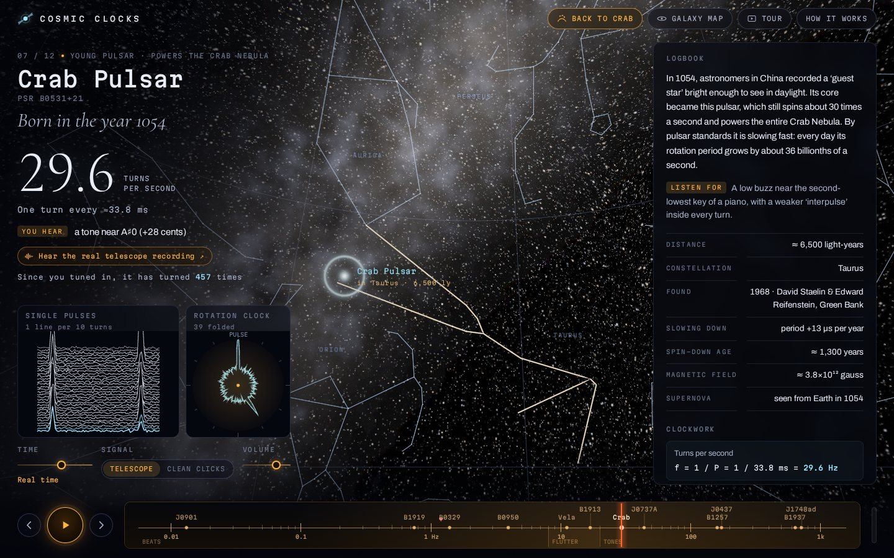<br><sub><b>Sky from Earth.</b> The Crab at the tip of Taurus's horn, among 5,000 real naked-eye stars.</sub></td>
<td>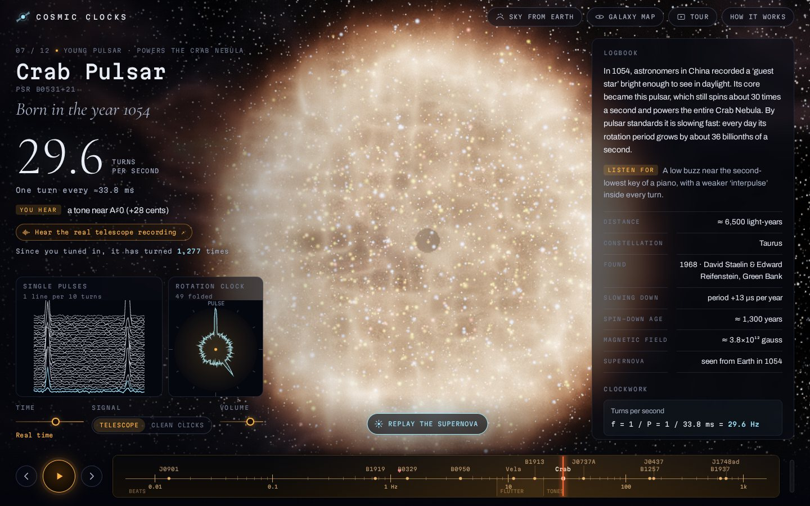<br><sub><b>Supernova replay.</b> The blast of 1054 expanding before the Crab Nebula forms around the newborn pulsar.</sub></td>
</tr>
<tr>
<td>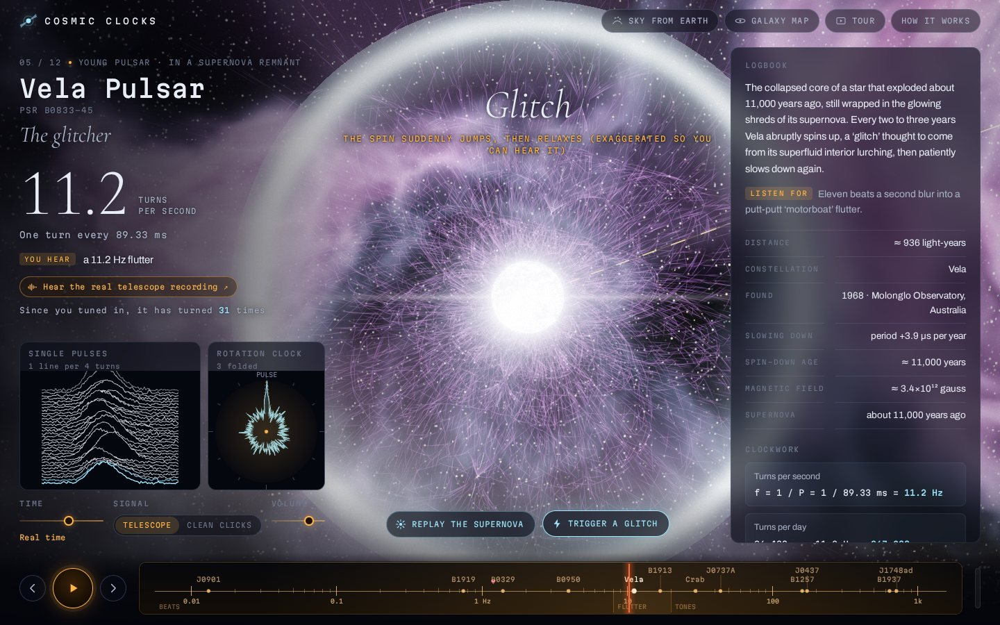<br><sub><b>A Vela glitch.</b> The star's crust "quakes", the spin jumps, and you hear the pitch change.</sub></td>
<td>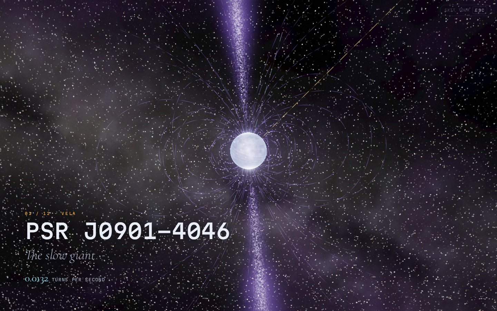<br><sub><b>Tour mode.</b> A hands-free, full-screen trip through all twelve.</sub></td>
</tr>
</table>

<table>
<tr>
<td width="33%">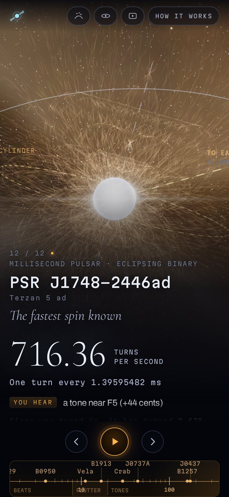</td>
<td width="33%">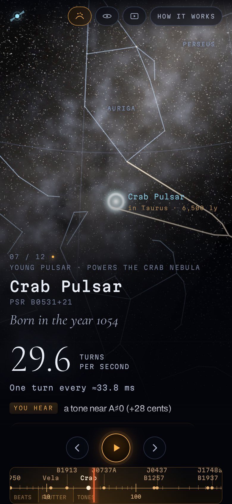</td>
<td width="33%">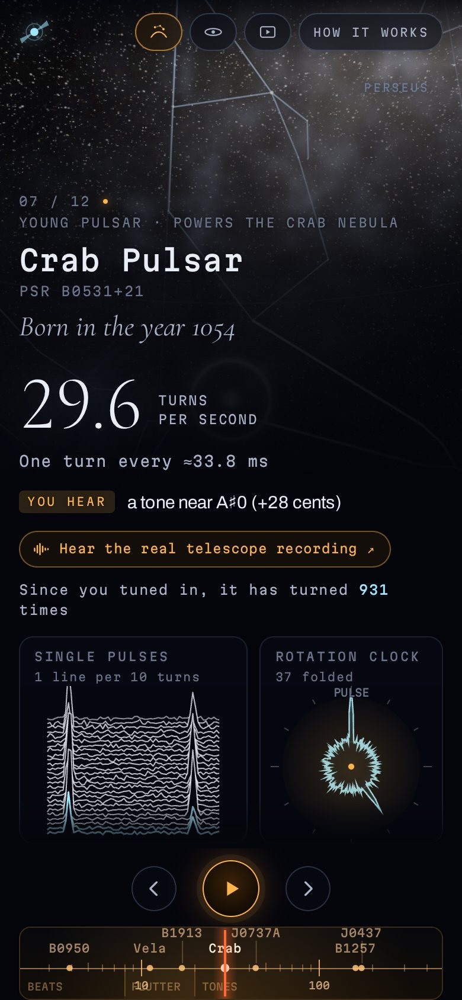</td>
</tr>
<tr><td colspan="3"><sub><b>On a phone.</b> The same site: scroll down for the instruments and the logbook.</sub></td></tr>
</table>

## What's in it

- **Real spin rates, played live.** Each pulsar is synthesised in the browser at its measured rate, from
  PSR J0901−4046 (one turn every 76 s) to **PSR J1748−2446ad** (716 turns every second, the fastest spin
  known). Slow pulsars are a heartbeat, the Vela pulsar is a "motorboat" flutter, and millisecond pulsars
  fuse into a musical note: the page names it (J1748−2446ad sits just above F5).
- **A radio tuning dial** on a logarithmic spin-rate scale, marked with where rhythm turns into flutter and
  flutter into pitch. Drag it to scan: stations fade in through static and a heterodyne whistle.
- **A 3D scene for every star** (WebGL2, hand-written shaders): a neutron star with hot polar caps, its
  dipole magnetic field, volumetric radio beams that sweep past the "to Earth" line exactly when you hear
  the tick, plus each system's surroundings: the Crab and Vela nebulae, the Terzan 5 star cluster, the
  planets of PSR B1257+12, the double pulsar's partner, and a spacetime grid rippling with gravitational
  waves around the Hulse–Taylor binary. For millisecond pulsars the light cylinder is drawn to scale.
- **Travel through the galaxy.** Switching stars zooms out, flies across a particle Milky Way to the next
  pulsar's real Galactic position, and zooms back in. A galaxy map shows all twelve at once.
- **Instruments that read the same signal you hear:**
  - *Single pulses*, stacked like the 1970 plot of CP 1919 that became the cover of Joy Division's
    *Unknown Pleasures*. Every turn is slightly different; the newest is drawn as it arrives.
  - *Rotation clock*: thousands of noisy pulses folded into one stable profile, the way astronomers turn
    a pulsar into a clock, with a hand that turns once per rotation.
- **The arithmetic, shown.** Turns per day, light-cylinder radius, equator speed, spin-down age and
  magnetic field are calculated from the measured period and spin-down rate for each star.
- **Time control** from 1000× slower (hear a 716 Hz tone fall apart into single ticks) to 100× faster.
- **Sky from Earth.** Swing round to Earth's view of the sky: about 5,000 real naked-eye stars in their true
  colours, the constellation figures, the Milky Way along the true galactic plane, and the pulsar blinking
  where it really sits (the Crab at the tip of Taurus's horn, J1748−2446ad toward the galactic centre).
  Switching pulsars in this view swings the camera across the sky to the next one.
- **Cosmic events.** Replay the Crab's supernova of 1054 (a red supergiant collapses, explodes into an
  expanding shell and debris, and the nebula forms around a newborn pulsar) or Vela's; trigger a Vela
  "starquake" glitch you can see and hear; and watch giant pulses from the Crab, B1937+21 and B0950+08
  flash down the line of sight in step with the crack in the audio.
- **Tour mode.** A full-screen autopilot through all twelve pulsars with cinematic captions, the supernova
  and glitch included, ending on the sky from Earth. Any key or click exits.
- **Real recordings.** Six of the pulsars link to Jodrell Bank Observatory's real telescope recordings.

## Controls

| Key | Action |
| --- | --- |
| `←` `→` | previous / next pulsar (slowest to fastest) |
| `Space` | play / pause |
| `M` | galaxy map |
| `S` | the sky from Earth |
| `T` | tour mode |
| `[` `]` `0` | slow time down, speed it up, back to real time |
| `?` | how it works |

Drag the sky to look around, scroll to zoom, drag the dial to scan between stations.
Deep links work too: [`…/cosmic-clocks/#j1748`](https://mateuszkrw-coder.github.io/cosmic-clocks/#j1748) opens
the fastest pulsar directly, and `#b1919` the first one found.

## The twelve

| Pulsar | Spin period | Turns per second | Why it matters |
| --- | --- | --- | --- |
| PSR J0901−4046 | 75.88 s | 0.0132 | among the slowest radio pulsars known |
| PSR B1919+21 | 1.337302 s | 0.748 | the first pulsar ever found (1967) |
| PSR B0329+54 | 0.7145197 s | 1.40 | the classic "sound of a pulsar" |
| PSR B0950+08 | 0.2530652 s | 3.95 | a close neighbour with giant pulses |
| Vela | 89.33 ms | 11.2 | young, glitching, inside its supernova remnant |
| PSR B1913+16 | 59.03 ms | 16.9 | Hulse–Taylor binary, 1993 Nobel Prize |
| Crab | ≈33.8 ms | 29.6 | born in the supernova seen in 1054 |
| PSR J0737−3039A | 22.69938 ms | 44.1 | the only double pulsar |
| PSR B1257+12 | 6.218532 ms | 160.8 | first confirmed exoplanets (1992) |
| PSR J0437−4715 | 5.757451941593412 ms | 173.7 | the nearest, most precisely timed millisecond pulsar |
| PSR B1937+21 | 1.557806 ms | 641.9 | the first millisecond pulsar (1982) |
| PSR J1748−2446ad | 1.39595482 ms | 716.4 | the fastest spin known |

## How the sound is made

`js/dsp.js` models each pulse as a sum of Gaussian components (a stylised version of the pulsar's
measured profile). Every turn gets its own brightness, jitter, occasional nulls or giant pulses, and
slow interstellar "twinkling", all derived from a hash of the turn number, so the audio thread and the
visuals reconstruct exactly the same pulses without talking to each other. The synthesiser runs in an
AudioWorklet (with a ScriptProcessor fallback) and reports its phase against the audio clock; the scene
and instruments read that phase so the beam crosses the Earth line the moment you hear the tick.

*Telescope* mode fills each pulse with receiver noise, like a radio recording; *Clean clicks* turns each
pulse into a crisp tick. The rates are real; pulse shapes and noise are illustrative, and so are the
scenes (real beams are invisible radio waves, and sizes and orbits are not to scale).

## Files

```
index.html          page structure
css/style.css       layout and type
js/data.js          the catalogue: periods, distances, stories, sound and scene settings
js/sky-data.js      naked-eye stars and constellation figures (generated)
js/dsp.js           pulse model + synthesiser (shared with the AudioWorklet)
js/audio.js         Web Audio engine: worklet, reverb, limiter, phase reporting
js/gl.js            small WebGL2 and matrix helpers
js/scene.js         the 3D scene, galaxy, travel and post-processing
js/instruments.js   pulse stack, rotation clock, tuning dial
js/app.js           state, navigation, controls
tools/build.mjs     bundles everything into dist/cosmic-clocks.html
tools/make-sky-data.mjs  regenerates js/sky-data.js from the d3-celestial package
docs/screenshots/    the images in this README
```

Run `node tools/build.mjs` after editing to refresh the single-file bundle.

## Sources

Spin periods, spin-down rates and distances: the ATNF Pulsar Catalogue (Manchester et al. 2005) and the
discovery papers: Hewish et al. 1968; Large, Vaughan & Mills 1968; Staelin & Reifenstein 1968;
Hulse & Taylor 1975; Backer et al. 1982; Wolszczan & Frail 1992; Johnston et al. 1993;
Burgay et al. 2003; Hessels et al. 2006; Caleb et al. 2022. Distances use parallax measurements where
they exist (e.g. Vela, B0950+08, J0437−4715, B1913+16).

The sky from Earth uses the XHIP compilation of Hipparcos stars (Anderson & Francis 2012) and the IAU
constellation figures as packaged in [d3-celestial](https://github.com/ofrohn/d3-celestial)
(BSD-3-Clause, © 2015 Olaf Frohn). Real telescope recordings: Jodrell Bank Observatory,
[The Sounds of Pulsars](https://www.jb.man.ac.uk/research/pulsar/Education/Sounds/).
The supernova replay is an artistic illustration, and the glitch is exaggerated about ten-thousand-fold so
that it is audible (real Vela glitches change the spin rate by about one part in a million).
